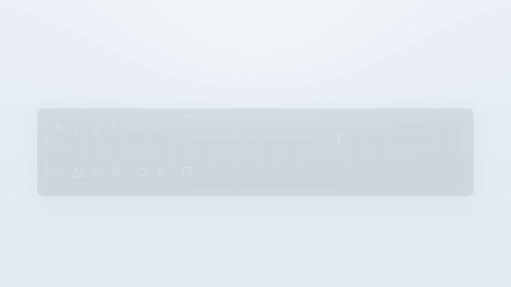
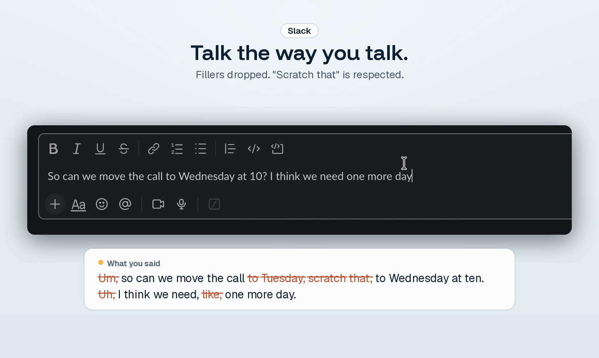
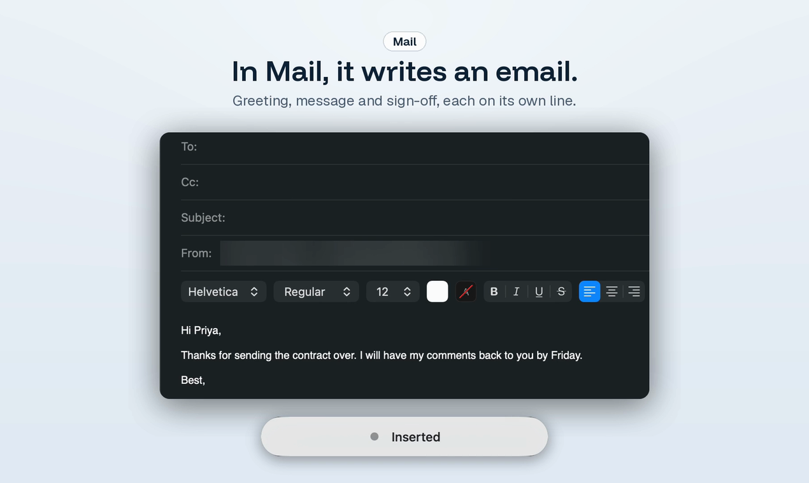
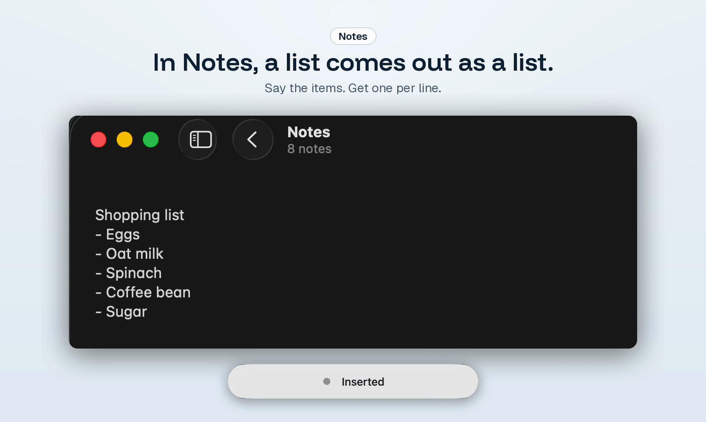
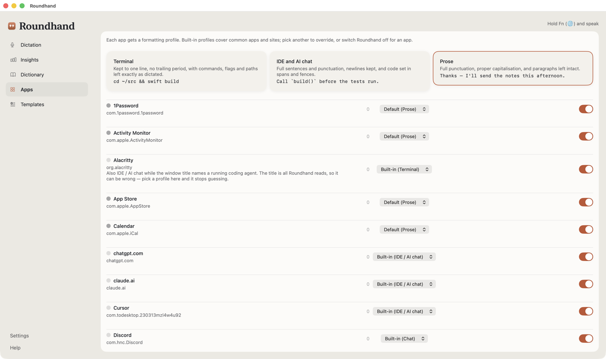
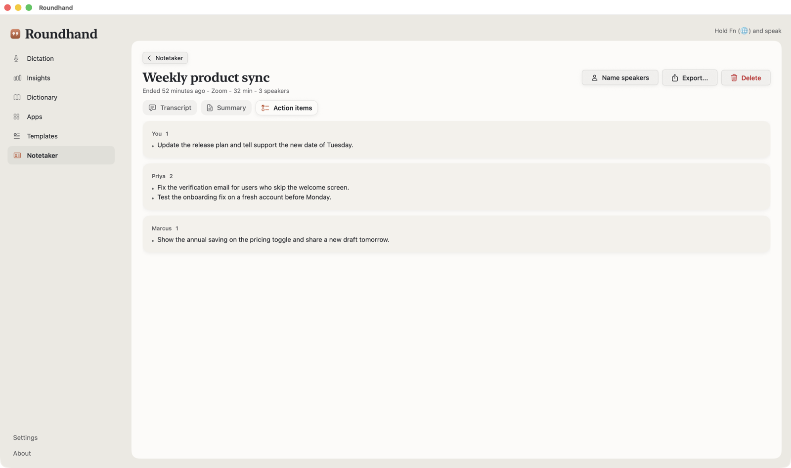

# Roundhand

**Mac dictation that writes for the app you're in.**

Hold a key, talk, let go. Roundhand writes clean text at your cursor, shaped for the app in front of you: short in Slack, a proper email in Mail, a list in Notes.

[**Download for Mac**](https://roundhand.dev) | [Watch the 60-second demo](https://www.youtube.com/watch?v=DUsTHgtK1wI) | [Pricing](https://roundhand.dev/pricing) | [Privacy](https://roundhand.dev/privacy)

Free to download, no account needed. Apple silicon Macs, macOS 14 or later.

## One sentence, three apps

<table>
  <tr>
    <td width="33%"></td>
    <td width="33%"></td>
    <td width="33%"></td>
  </tr>
  <tr>
    <td><b>Slack</b> A short message. Ums dropped, "scratch that" respected.</td>
    <td><b>Mail</b> Greeting, message and sign-off, each on its own line.</td>
    <td><b>Notes</b> A list.</td>
  </tr>
</table>

In a terminal you get one line with no trailing full stop. Roundhand picks the style from the app that has focus, and you can change it per app.

## What it does

- **Hold a key and talk.** The text lands at your cursor in any app.
- **Cleans up as you speak.** Drops fillers like "um" and "uh", keeps the version you meant when you restart a sentence ("Tuesday, scratch that, Wednesday"), and fixes capitals and punctuation.
- **Four styles, picked from the app in front of you.** Terminal, IDE and AI chat, Chat, and Prose, each changeable per app.
- **A Dictionary** that sets how words you say are written, such as a product name.
- **25 languages**, detected automatically, or up to three you choose.
- **Password fields are left alone.** It will not read or type into them.
- **Meeting Notetaker.** When Zoom, Teams, Meet or another call app starts using the microphone, Roundhand offers to record. Afterwards you get a transcript with each speaker labelled. With cloud cleanup on, it also writes a summary and the action items.

## Privacy

Speech is recognised on your Mac. Dictation audio is never uploaded or saved to disk.

The default cleanup is a set of rules that runs on your Mac. Optional cloud cleanup sends the text, never the audio, to a language model, either on a managed plan or with your own API key.

A meeting you record is kept in a temporary file on your Mac while it is transcribed, then deleted, unless you turn on Keep audio. Audio is never uploaded. Full details: [roundhand.dev/privacy](https://roundhand.dev/privacy).

## Install

Requires an **Apple silicon** Mac on macOS 14 or later. Intel Macs are not supported.

- **From the website:** [roundhand.dev](https://roundhand.dev)
- **Direct download:** the `.dmg` on the [latest release](https://github.com/avisangle/roundhand-releases/releases/latest)
- **Homebrew:** `brew install --cask avisangle/roundhand/roundhand`

The speech model downloads once on first launch. After that, dictation and the built-in cleanup work without a connection. Roundhand updates itself through the feed in this repository.

## Pricing

Dictation and the cleanup that runs on your Mac are free, with no account needed. Paid plans add cloud cleanup. See [roundhand.dev/pricing](https://roundhand.dev/pricing).

## Feedback

Roundhand is built by one person. I most want to hear which technical words it mishears and which apps misbehave when it inserts text. Please [open an issue](https://github.com/avisangle/roundhand-releases/issues) with the word and the app you were in.

Roundhand is closed source. This repository holds the releases and the update feed. A Windows version is in development.

For maintainers: what lives in this repository

| File | Purpose |
|---|---|
| `appcast.xml` | Sparkle update feed, served at `https://avisangle.github.io/roundhand-releases/appcast.xml`. Regenerated and EdDSA-signed by the release pipeline; never edit by hand except to withdraw a release |
| `index.html` | Download page served by GitHub Pages |
| `docs/` | Images used by this README |

Releases and their `.dmg` assets are published here because release assets on a private repository are served only to authenticated users, so neither Sparkle nor a browser could fetch them from the source repository.

